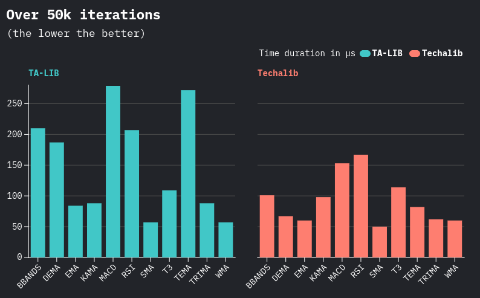
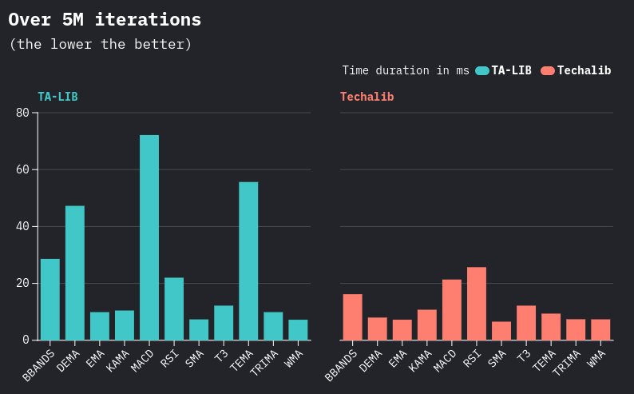

# Techalib

**Techalib** is a fast, reliable, and ergonomic technical analysis library written in Rust, with seamless Python bindings.

Inspired by TA-LIB, Techalib has been extensively tested against it to ensure accuracy and performance.

🚧 Techalib is in active development. More features, indicators, and improvements will come.

## 📦 Installation

Rust
---

**Available soon on Cargo**

Python
---

**Available soon on PyPI**

## 📚 Documentation

Rust
---

**Available soon**

Python
---

**Available soon**

## ⚡ Benchmarks

Techalib matches TA-LIB in performance and, for specific indicators, achieves even faster execution through algorithmic optimizations.

## 📊 Supported indicators

The number of supported indicators is set to increase.

| **Category**              | **Function name - Name**                                        | **Status** |
| ----------------          | ---------------------------------------------                   | ---------- |
| **_Overlap_**             |||
|                           | **bbands** - Bollinger Bands                                    | ✅        |
|                           | **midpoint** - MidPoint over period                             | ✅        |
|                           | **midprice** - Midpoint Price over period                       | ✅        |
| _Moving Average_          | **sma** - Simple Moving Average                                 | ✅        |
|                           | **ema** - Exponential Moving Average                            | ✅        |
|                           | **wma** - Weighted Moving Average                               | ✅        |
|                           | **dema** - Double Exponential Moving Average                    | ✅        |
|                           | **tema** - Triple Exponential Moving Average                    | ✅        |
|                           | **trima** - Triangular Moving Average                           | ✅        |
|                           | **t3** - Tillson Triple Moving Average                          | ✅        |
|                           | **kama** - Kaufman Adaptive Moving Average                      | ✅        |
| **_Momentum_**            |||
|                           | **macd** - Moving Average Convergence Divergence                | ✅        |
|                           | **adx** - Average Directional Movement Index                    | ⬜        |
|                           | **aroon** - Aroon                                               | ⬜        |
|                           | **dx** - Directional Movement Index                             | ⬜        |
|                           | **minus_di** - Minus Directional Indicator                      | ⬜        |
|                           | **minus_dm** - Minus Directional Movement                       | ⬜        |
|                           | **plus_di** - Plus Directional Indicator                        | ⬜        |
|                           | **plus_dm** - Plus Directional Movement                         | ⬜        |
|                           | **roc** - Rate of change                                        | ⬜        |
|                           | **rocr** - Rate of change ratio                                 | ⬜        |
|                           | **rocr100** - Rate of change ratio 100 scale                    | ⬜        |
| _Oscillator_              | **rsi** - Relative Strength Index                               | ✅        |
|                           | **aroonosc** - Aroon Oscillator                                 | ⬜        |
| **_Volume_**              |||
|                           | **ad** - Chaikin A/D Line                                       | ⬜        |
| **_Volatility_**          |||
|                           | **atr** - Average True Range                                    | ⬜        |

## 🤓 Contribution

To contribute to the techalib project, first fork the repository and create a new branch from upstream/main using a proper naming convention (feat/, fix/, etc.). Set up your development environment by installing Python, Rust, and project dependencies, then build the project and run tests. If you're adding a new indicator, use the provided tools to generate boilerplate code and test data, and follow the inserted TODO comments. Follow the commit message guidelines and rebase your branch onto the latest changes from upstream/main. Finally, open a pull request with a clear description, allow edits by maintainers, and be ready to respond to review feedback.

For a more detailed description please read this [guidelines](CONTRIBUTING.md) before submitting a pull request.
